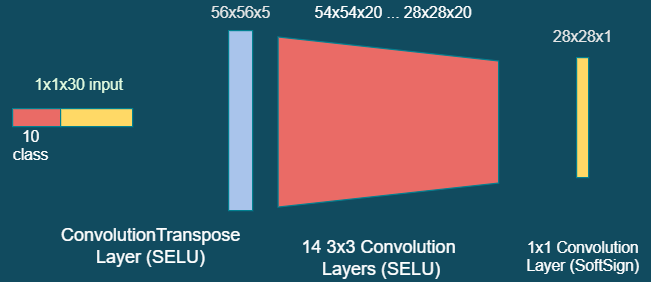
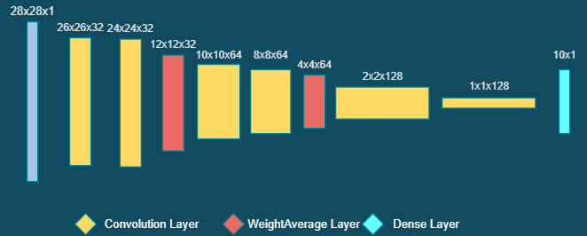
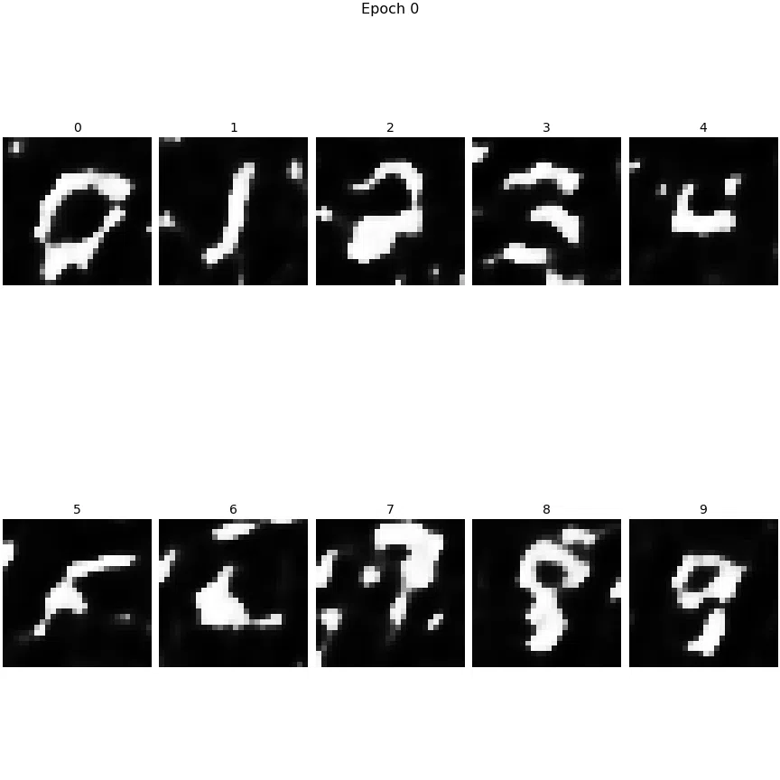

# MNIST-CGAN

Simple Conditional Generative Adverserial Network for MNIST DataSet is implemented in [Keras](https://keras.io).

## Implementation Details

### Generator

The Activation of Generator is **Scaled Exponential Linear Unit**(Selu). According to *Self-Normalizing Neural Network*, it can avoid gradient vanishing and gradient exploding as long as the inputs with zero mean and unit variance. Since the inputs of generator are arbitrary, it choose **selu** as activation.

### Discriminator

In Discriminator, it chooses weight average pooling to replace max pooling.

## Result

